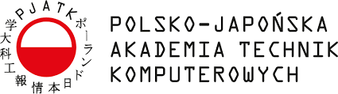
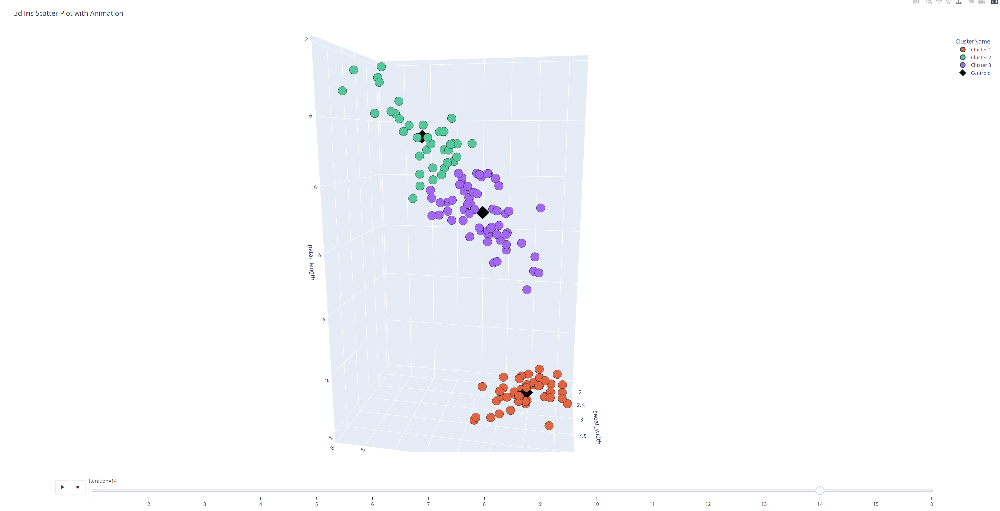
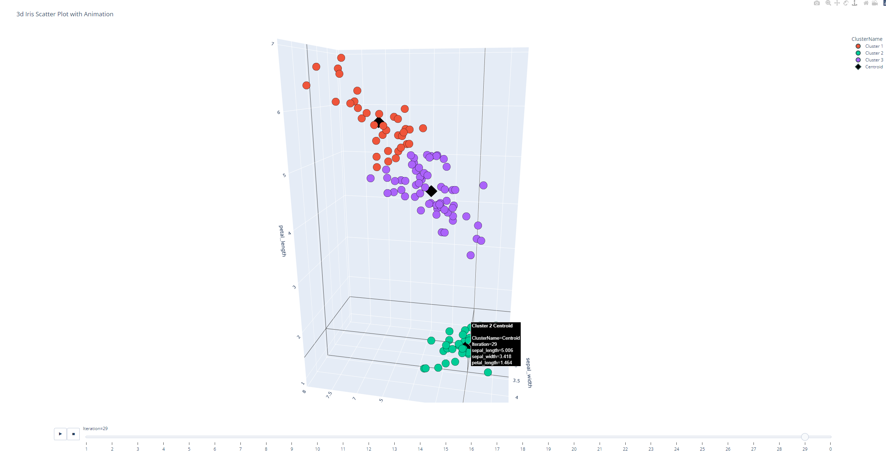
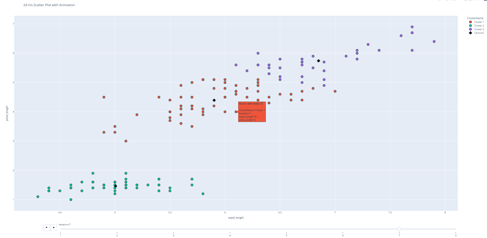

<div align="center">

# Cluster K-Means Algorithm

</img>

## PJAIT - Artificial Intelligence Tools (NAI)

### Cyprian Gburek

s24759, 17c

</div>
<br>

## Table of Contents

- [General info](#general-info)
- [Technologies](#technologies)
- [Setup](#setup)
- [Results](#results)
- [Credits](#credits)

## General info

The project is a part of the Artificial Intelligence Tools (NAI) course at PJAIT. The goal of the project was to implement the Cluster K-Means algorithm and test it on a dataset of our choice. The dataset I chose was a small Iris dataset, which contains 150 samples of 3 different species of Iris flowers. The dataset contains 4 features: sepal length, sepal width, petal length and petal width. The goal of the algorithm is to cluster the samples into 3 clusters, each representing a different species of Iris flower.

## Technologies

<br/>

[](https://dotnet.microsoft.com/en-us/apps/aspnet)

<br/>

- **Backend**:
    - C#
    - .NET Core 7.0 (Web API)
- **Frontend**:
    - Python 3.9
    - Pandas
    - Plotly

## Setup

To run this project, you need to have .NET Core 7.0 installed on your machine. You can download it from [here](https://dotnet.microsoft.com/download/dotnet/7.0).

After installing .NET Core, you can clone the repository and run the project using the following commands:

```bash
# Clone the repository
git clone
```

```bash
# Navigate to the project directory from project root
cd Cluster-K-Means-NAI-Server
```

```bash
# Run the project
dotnet run
```
After running the project, you can access the API at specified port (default: 7097).

Now you can run the Python script to test the algorithm on the Iris dataset. To do so, you need to have Python 3.9 installed on your machine. You can download it from [here](https://www.python.org/downloads/).

After installing Python, you can run the script using the following commands:

```bash
# Navigate to the project directory from project root
cd ClientApp
```

```bash
# Install the required dependencies from requirements.txt
pip install -r requirements.txt
```

```bash
# Run the script with specified parameters
python main.py [k number of clusters] [path to dataset]
```

If needed, edit the [main.py](./ClientApp/main.py) file to change various parameters of the algorithm, such as number of clusters, number of iterations, 3D Scatter or 2D, etc.

## Results

The algorithm was able to cluster the samples into 3 clusters, each representing a different species of Iris flower. The results are presented with following examples:





## Credits

- [Iris Dataset](https://archive.ics.uci.edu/ml/datasets/iris)
- [Plotly](https://plotly.com/python/)
- [Pandas](https://pandas.pydata.org/)
- [Asp.NET Core](https://dotnet.microsoft.com/apps/aspnet)
- [C#](https://docs.microsoft.com/en-us/dotnet/csharp/)
- [Python](https://www.python.org/)
- [PJAIT](https://www.pja.edu.pl/) - The Polish-Japanese Academy of Information Technology.
- [Cyprian Gburek](https://sircypkowskyy.github.io/) - Author of the project.
